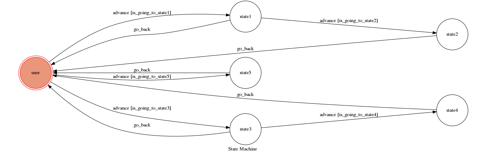

# Project 2017

## 環境設置
  * Python3
  * 安裝
    ```sh
    pip3 install requests
    pip3 install beautifulsoup4
    pip install -r requirements.txt
    ```
  * 變數內容設置
    需要設置app.py中的變數`API_TOKEN`以及 `WEBHOOK_URL`

## 程式執行
  * 使用`ngrok`
    ```sh
    ./ngrok http 5000
    ```
    執行後會產生一個https URL
  * `WEBHOOK_URL` = `your-https-URL/hook`
  * run the server
    ```sh
    python3 app.py
    ```
## Finite State Machine


## 使用方法
* user(初始狀態)
	* 使用者輸入: XX縣(市)天氣
	    * 進到state1 
		* Chatbot回應: 該縣市的天氣

	* 使用者輸入: 星座運勢
	    * 進到state3 
		* Chatbot回應: 請輸入您的星座
		
	* 使用者輸入: 每日一句
	    * 進到state5 
		* Chatbot回應: 一句名言佳句
		* 回到user
* state1
    * 使用者輸入: 詳細資料
        * 進到state2    
        * Chatbot回應: 該縣市的紫外線及體感溫度
        * 回到user
        
    * 使用者輸入: 不用
        * 回到user
* state3: 
    * 使用者輸入: 星座
        * 進到state4 
        * Chatbot回應: 所輸入星座的星座運勢
        * 回到user
